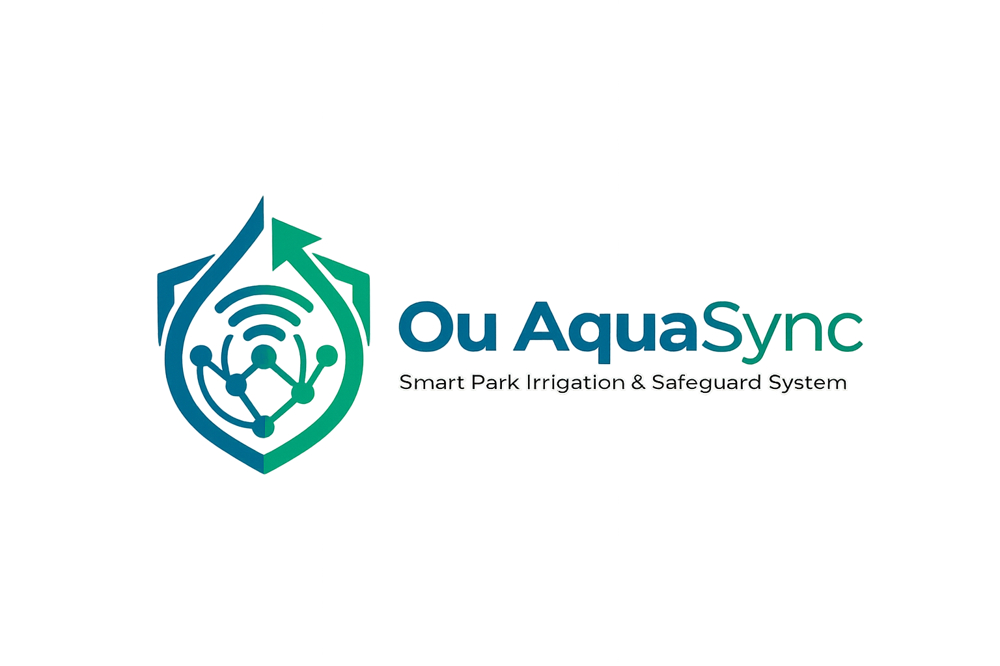

# Ou AquaSync - Smart Park Irrigation System

AquaSync is an IoT project that manages park irrigation based on real soil moisture data. It also includes a safety feature to detect pipe leaks and stop water waste.

## Features
* Automatic Irrigation: Turns the main water valve on or off depending on soil moisture levels.
* Leak Detection: If the valve is open but the moisture level stays low for too long, the system identifies it as a leak, closes the valve, and triggers an emergency alarm.
* Maintenance Mode: A manual override that lets workers pause the system while they work in the field.
* System Logging: All events, commands, and alarms are saved locally to an SQLite database.

## System Architecture
The project is written in Python and uses the MQTT protocol (via a public HiveMQ broker) to connect the different components:
* Sensor: Simulates soil moisture data and publishes it to the broker.
* Actuator (Valve): Listens for ON/OFF commands to control the water valve.
* Data Manager: The main logic script. It reads the sensor data, updates the database, and sends operational commands to the actuator.
* GUI Dashboard: Built with PyQt5. Shows live system status, event logs, and includes buttons for manual overrides.

## Technologies
* Python 3
* Eclipse Paho MQTT
* PyQt5
* SQLite3

## How to Run
To test the system locally, open separate terminal windows and run these scripts:
1. `python data_manager.py`
2. `python sensor_moisture.py`
3. `python actuator_valve.py`
4. `python gui_app.py`